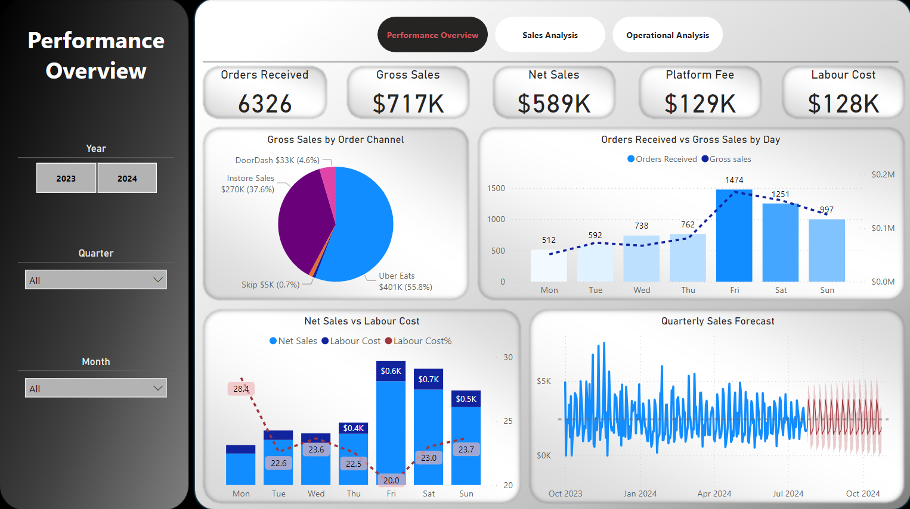
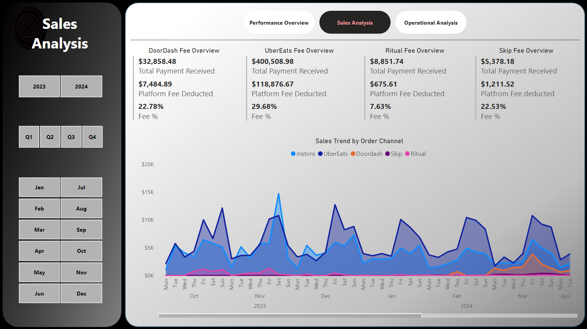
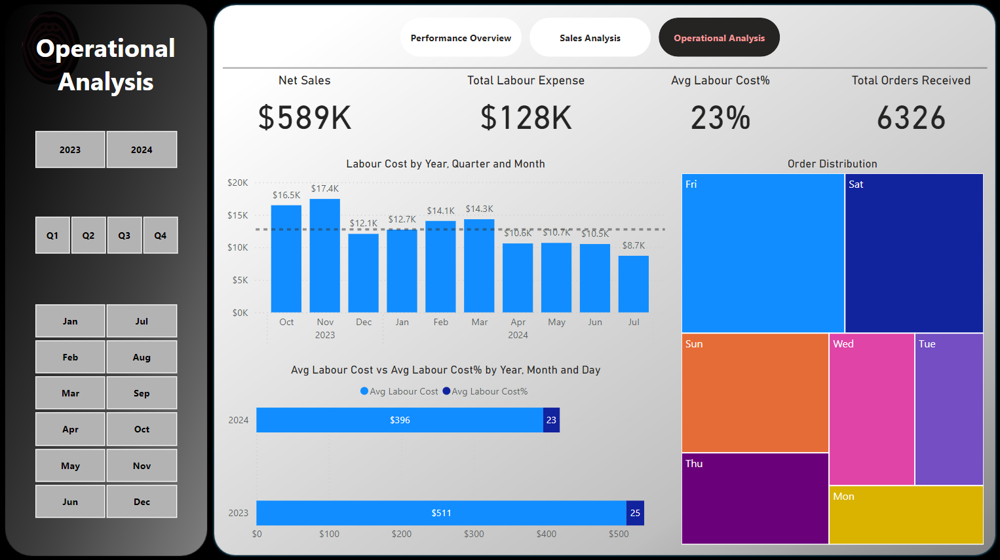

# Business Problem Overview
## Blondie’s Pizza, particularly the Eglinton branch, faces two major challenges:
- Platform Fees Impact on Revenue: Increasing costs from online order platforms are reducing overall revenue.
- Sales-to-Overhead Cost Ratio: Rising operational costs, especially labour, are negatively affecting cost-effectiveness.

## Objectives:
- **Platform Cost Analysis:** Identify the most cost-effective online platform by analyzing sales data.
- **Operational Cost Analysis:** Evaluate the sales-to-overhead cost ratio and provide insights into cost management.
- **Sales Forecasting:** Utilize BI tools to forecast future sales and operational costs.

# Analytical Questions
## Descriptive Analytics:
**Customer Engagement Rate per Platform:**
- How engaged are customers through different sales channels (e.g., Uber, Skip the Dishes, website orders)?
**Sales-to-Overhead Cost Ratio:**
- What is the ratio between sales and operational overhead costs, particularly labour?

## Diagnostic Analytics:
**Seasonality in Order Patterns:**
- Are there seasonal trends in customer orders, and how do they affect sales and operational planning?

## Predictive Analytics:
**Sales Forecasting (Quarterly):**
- How can past and current sales data be used to forecast future sales for the upcoming months?
- How can these forecasts help internal stakeholders plan resource utilization and cost optimization?

# Solution
- *Page 1:* Performance Overview   

- *Page 2:* Sales Analysis

- *Page 3:* Operation Analysis

# Key Metrics and Insights:
## Platform Fees Impact on Revenue
**Platform Fees Reduction:**
- A 5% reduction in platform fees could increase monthly revenue by 6%.
- A 3% reduction in platform fees would result in a 3.6% boost in monthly revenue.
- Actionable Insight: Prioritize customer engagement through the most cost-effective online ordering platform to minimize fees while maintaining sales.

## Sales-to-Overhead Cost Ratio Optimization
**High-Cost Days Identified:**
- Operations on Monday, Tuesday, and Wednesday present the highest cost-to-sales ratio.

**Revenue Improvement Potential:**
- Optimizing labor scheduling and operational costs on these days could result in a 3% increase in overall revenue.
- Actionable Insight: Adjust labor scheduling and operational processes on high-cost days to improve cost-effectiveness.

## Sales Forecasting
**Projected Sales Growth (Quarterly):**
- Based on historical sales data, forecasts predict a steady growth trajectory in the next quarter, helping in resource planning and budgeting.
- Actionable Insight: Utilize sales forecasts to adjust inventory and staffing levels in anticipation of demand, avoiding overstaffing and reducing waste.

## Customer Engagement and Platform Performance
**Most Cost-Effective Platforms:**
- Data indicates that direct website orders have the lowest platform fee-to-revenue ratio, while third-party platforms (e.g., Uber, Skip the Dishes) incur significantly higher fees.
- Actionable Insight: Focus marketing efforts on promoting direct website orders and incentivize customers to use this platform over third-party alternatives.
